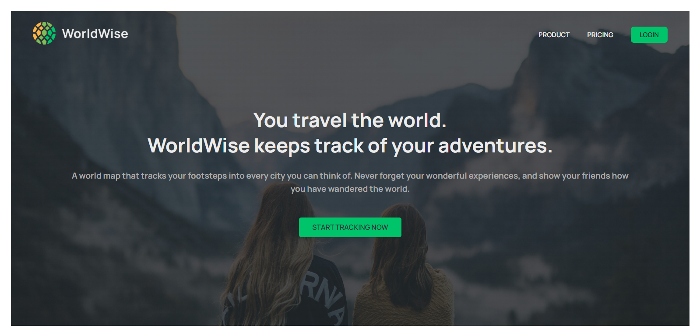

# 🌍 TravelTracker Web App


> A clean and modern travel log application made using **React**, **Vite**, and **JSON Server**.

[](https://app.netlify.com/projects/worldwise-by-tilak/deploys)
[](https://worldwise-api-3.onrender.com/cities)

---

## 📸 Screenshots

| Homepage                                             | Product Page                                       |
| ---------------------------------------------------- | -------------------------------------------------- |
|  |  |

| Pricing Page                                       | App Layout (Sidebar + Map)                              |
| -------------------------------------------------- | ------------------------------------------------------- |
|  |  |

| Add City                                             | Review City Details                                          |
| ---------------------------------------------------- | ------------------------------------------------------------ |
|  |  |

---

## 🚀 Features

- 🌐 View a list of visited cities
- 📝 Add cities with date, description, and coordinates
- 🗑️ Delete a city
- 📍 View city details on a map
- ☁️ Works with deployed REST API (Render)
- 💾 Fully responsive and optimized

---

## 🛠️ Tech Stack

- **Frontend:** React, Vite
- **State Management:** useReducer, Context API
- **Styling:** CSS Modules
- **API:** JSON Server (hosted on Render)
- **Hosting:** Netlify (frontend), Render (backend)

---

## 📂 Project Structure

```
src/
├── components/       # Reusable UI components
├── Contexts/         # Context providers (Cities, Auth)
├── pages/            # Page components (Homepage, Login, etc.)
├── App.jsx           # Main application component
├── main.jsx          # App entry point
└── index.css         # Global styles
```

---

## 📦 Installation & Setup

1. **Clone the repository**

   ```bash
   git clone https://github.com/Tilak46/TravelTracker_Web.git
   cd TravelTracker_Web
   ```

2. **Install dependencies**

   ```bash
   npm install
   ```

3. **Run locally**

   ```bash
   npm run dev
   ```

4. **Build for production**
   ```bash
   npm run build
   ```

---

## 🔗 Live URLs

- **Frontend:** [https://worldwise-by-tilak.netlify.app](https://worldwise-by-tilak.netlify.app/)
- **API Backend:** [https://worldwise-api-3.onrender.com/cities](https://worldwise-api-3.onrender.com/cities)

---

## 🧪 API Endpoints

| Method | Endpoint      | Description     |
| ------ | ------------- | --------------- |
| GET    | `/cities`     | Get all cities  |
| GET    | `/cities/:id` | Get single city |
| POST   | `/cities`     | Add a new city  |
| DELETE | `/cities/:id` | Delete a city   |

---

## 🙋‍♂️ Author

**Tilak Patel**  
🔗 [GitHub @Tilak46](https://github.com/Tilak46)

---

## 📄 License

This project is licensed under the [MIT License](LICENSE).
